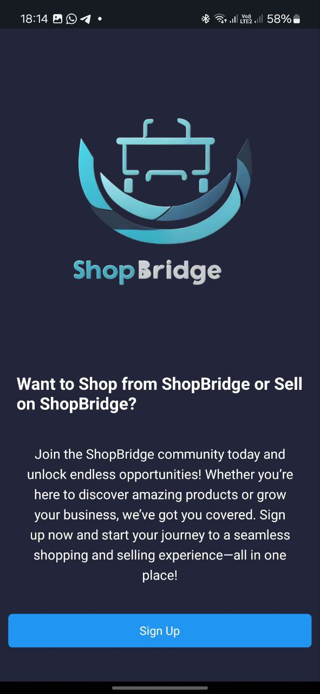
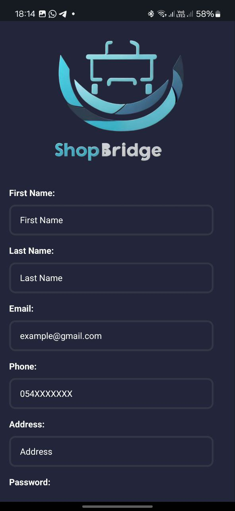
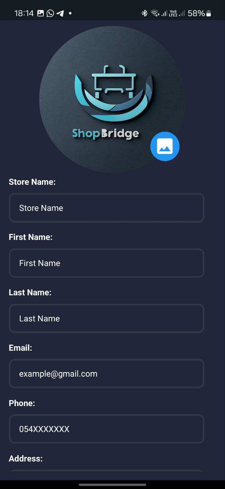
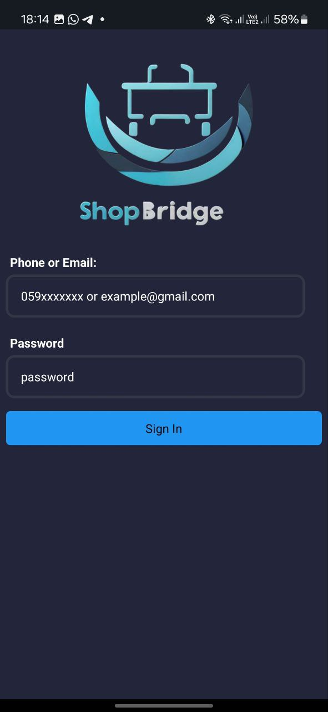
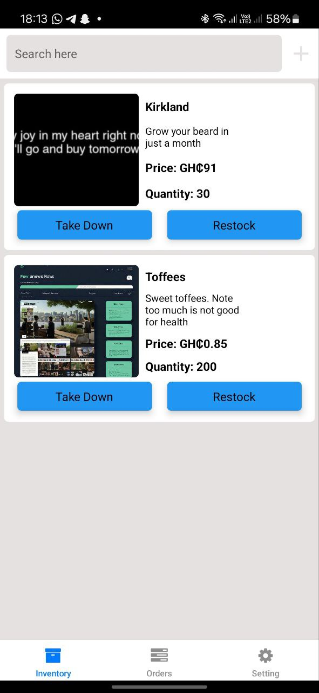
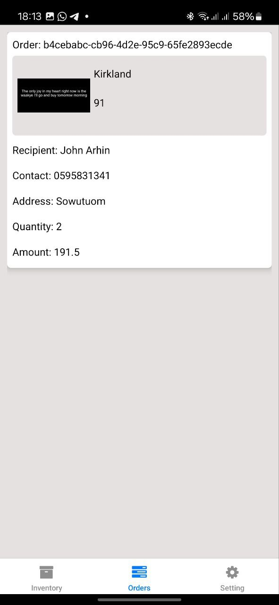
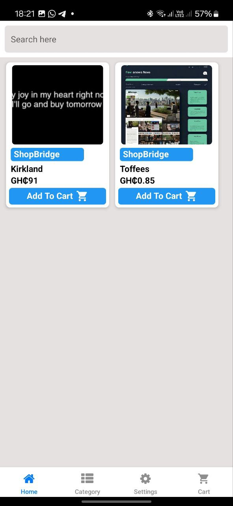
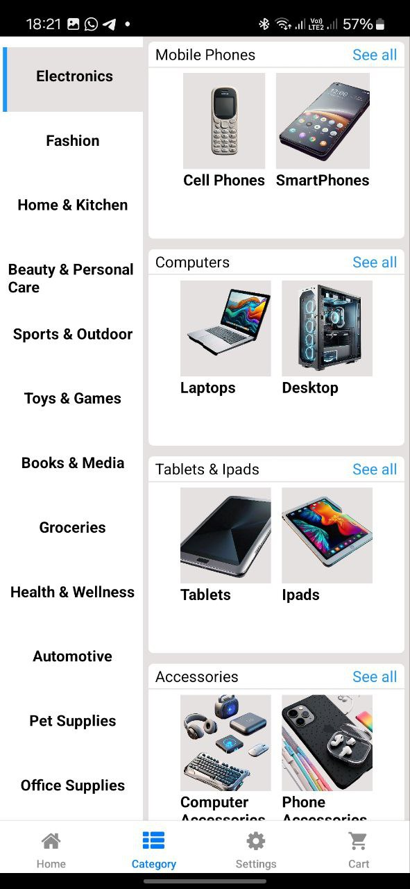
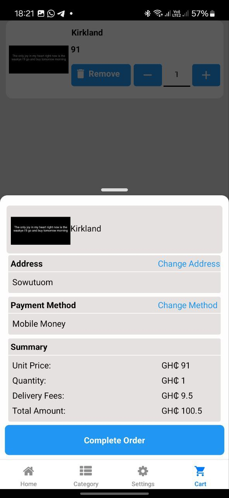

# ShopBridge - React Native E-commerce App

ShopBridge is a mobile e-commerce application built with **React Native** and **Expo**, designed to connect **sellers and consumers** efficiently. Sellers can manage their products and orders, while consumers can browse and purchase items seamlessly.

## 🚀 Features

- 🔹 **User Authentication** - Secure login and signup for buyers and sellers.
- 🛒 **Product Listings** - Display products in a grid using **FlatList**.
- 📦 **Order Management** - Sellers can view and manage orders.
- 🔍 **Product Search & Categories** - Filter products by categories.
- 💳 **Checkout & Payments** - Uses Paystack for payments.
- 🎨 **Modern UI** - Using **MaterialIcons, FontAwesome, and Ionicons** for a polished interface.

## 🛠️ Tech Stack

- **React Native** (Expo)
- **TypeScript**
- **SQLite3** (for local storage)
- **Expo Router** (for navigation)
- **React Native Gesture Handler** (for smooth interactions)
- **FastAPI** (For rest server)

## 📦 Installation

Clone the repository:

```sh
git clone https://github.com/chrisgithub2020/ShopBridge
cd shopbridge
```

#### *You must have a paystack key to for payment gateway to work*

```
## Navigate to this directory to change paystackKey
C:\Users\{username}\{path-to-shopbridge-folder}/api_calls

## open Keys.js and replace the paystack key with yours
```

     

Install dependencies:

```sh
npm install  # or yarn install
```

Run the app:

```sh
npm start
```


## 📸 Screenshots and Videos

<div>
 
 
 
 
 
 
 
 
 
 
</div>


https://github.com/user-attachments/assets/ec92d7c8-71f3-4843-b572-1e8524c03649


## 📌 Roadmap

- ✅ User authentication (Sign up/Login)
- ✅ Product listing & category filtering
- ✅ Integrate payment gateway
- ✅ Implement Toast notifications

## 🤝 Contributing

Contributions are welcome! If you'd like to improve ShopBridge, feel free to fork the repo and submit a pull request.

## 📜 License

This project is licensed under the MIT License.

---

⭐ **Star this repo** if you find it useful!

📩 **Need help?** Reach out via Issues or Discussions.
